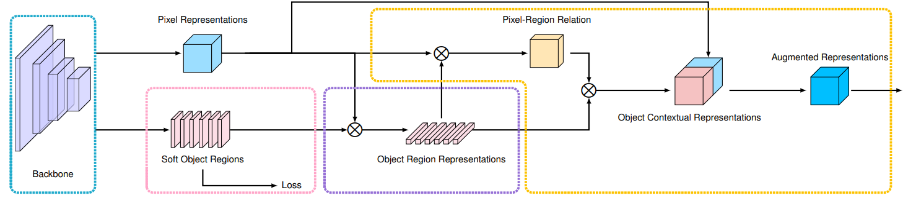

# High-resolution networks (HRNets) for Semantic Segmentation
## Branches
- This is the implementation for HRNet + OCR.
- The PyTroch 1.1 version ia available [here](https://github.com/HRNet/HRNet-Semantic-Segmentation/tree/pytorch-v1.1).
- The PyTroch 0.4.1 version is available [here](https://github.com/HRNet/HRNet-Semantic-Segmentation/tree/master).

## Research Paper  
**HRNet: https://arxiv.org/abs/1904.04514**    
**HRNet: https://arxiv.org/pdf/1908.07919.pdf**  
**OCR: https://arxiv.org/pdf/1909.11065.pdf**  


## Introduction
This is the official code of [high-resolution representations for Semantic Segmentation](https://arxiv.org/abs/1904.04514). 
We augment the HRNet with a very simple segmentation head shown in the figure below. We aggregate the output representations at four different resolutions, and then use a 1x1 convolutions to fuse these representations. The output representations is fed into the classifier. We evaluate our methods on three datasets, Cityscapes, PASCAL-Context and LIP.

<!--  -->
<figure>
  <text-align: center;>
  
</figcaption>
</figure>

Besides, we further combine HRNet with [Object Contextual Representation](https://arxiv.org/pdf/1909.11065.pdf) and achieve higher performance on the three datasets. The code of HRNet+OCR is contained in this branch. We illustrate the overall framework of OCR in the Figure as shown below:

<figure>
  <text-align: center;>
  
</figure>

## Segmentation models
The models are initialized by the weights pretrained on the ImageNet. ''Paddle'' means the results are based on PaddleCls pretrained HRNet models.
You can download the pretrained models from  https://github.com/HRNet/HRNet-Image-Classification. *Slightly different, we use align_corners = True for upsampling in HRNet*.

1. Performance on the Cityscapes dataset. The models are trained and tested with the input size of 512x1024 and 1024x2048 respectively.
If multi-scale testing is used, we adopt scales: 0.5,0.75,1.0,1.25,1.5,1.75.

| model | Train Set | Test Set | OHEM | Multi-scale| Flip | mIoU | Link |
| :--: | :--: | :--: | :--: | :--: | :--: | :--: | :--: |
| HRNetV2-W48 | Train | Val | No | No | No | 80.9 | [Github](https://github.com/hsfzxjy/models.storage/releases/download/HRNet-OCR/hrnet_cs_8090_torch11.pth)/[BaiduYun(Access Code:pmix)](https://pan.baidu.com/s/1KyiOUOR0SYxKtJfIlD5o-w)|
| HRNetV2-W48 + OCR | Train | Val | No | No | No | 81.6 | [Github](https://github.com/hsfzxjy/models.storage/releases/download/HRNet-OCR/hrnet_ocr_cs_8162_torch11.pth)/[BaiduYun(Access Code:fa6i)](https://pan.baidu.com/s/1BGNt4Xmx3yfXUS8yjde0hQ)|
| HRNetV2-W48 + OCR | Train + Val | Test | No | Yes | Yes | 82.3 | [Github](https://github.com/hsfzxjy/models.storage/releases/download/HRNet-OCR/hrnet_ocr_cs_trainval_8227_torch11.pth)/[BaiduYun(Access Code:ycrk)](https://pan.baidu.com/s/16mD81UnGzjUBD-haDQfzIQ)|


## Quick start
### Install
1. For LIP dataset, install PyTorch=0.4.1 following the [official instructions](https://pytorch.org/). For Cityscapes and PASCAL-Context, we use PyTorch=1.1.0.
2. `git clone https://github.com/HRNet/HRNet-Semantic-Segmentation $SEG_ROOT`
3. Install dependencies: pip install -r requirements.txt

If you want to train and evaluate our models on PASCAL-Context, you need to install [details](https://github.com/zhanghang1989/detail-api).
````bash
pip install git+https://github.com/zhanghang1989/detail-api.git#subdirectory=PythonAPI
````

### Data preparation
You need to download the [Cityscapes](https://www.cityscapes-dataset.com/), [LIP](http://sysu-hcp.net/lip/) and [PASCAL-Context](https://cs.stanford.edu/~roozbeh/pascal-context/) datasets.

Your directory tree should be look like this:
````bash
$SEG_ROOT/data
├── urbanisation
│   ├── x
│   │   ├── test
│   │   ├── train
│   │   └── val
│   └── y
│       ├── test
│       ├── train
│       └── val
````

### Train and Test

#### PyTorch Version Differences

Note that the codebase supports both PyTorch 0.4.1 and 1.1.0, and they use different command for training. In the following context, we use `$PY_CMD` to denote different startup command.

```bash
# For PyTorch 0.4.1
PY_CMD="python"
# For PyTorch 1.1.0
PY_CMD="python -m torch.distributed.launch --nproc_per_node=4"
```


## Citation
If you find this work or code is helpful in your research, please cite:
````
@inproceedings{SunXLW19,
  title={Deep High-Resolution Representation Learning for Human Pose Estimation},
  author={Ke Sun and Bin Xiao and Dong Liu and Jingdong Wang},
  booktitle={CVPR},
  year={2019}
}

@article{WangSCJDZLMTWLX19,
  title={Deep High-Resolution Representation Learning for Visual Recognition},
  author={Jingdong Wang and Ke Sun and Tianheng Cheng and 
          Borui Jiang and Chaorui Deng and Yang Zhao and Dong Liu and Yadong Mu and 
          Mingkui Tan and Xinggang Wang and Wenyu Liu and Bin Xiao},
  journal={TPAMI},
  year={2019}
}

@article{YuanCW19,
  title={Object-Contextual Representations for Semantic Segmentation},
  author={Yuhui Yuan and Xilin Chen and Jingdong Wang},
  booktitle={ECCV},
  year={2020}
}
````

## Acknowledgement
We adopt sync-bn implemented by [InplaceABN](https://github.com/mapillary/inplace_abn) for PyTorch 0.4.1 experiments and the official 
sync-bn provided by PyTorch for PyTorch 1.10 experiments.

We adopt data precosessing on the PASCAL-Context dataset, implemented by [PASCAL API](https://github.com/zhanghang1989/detail-api).
